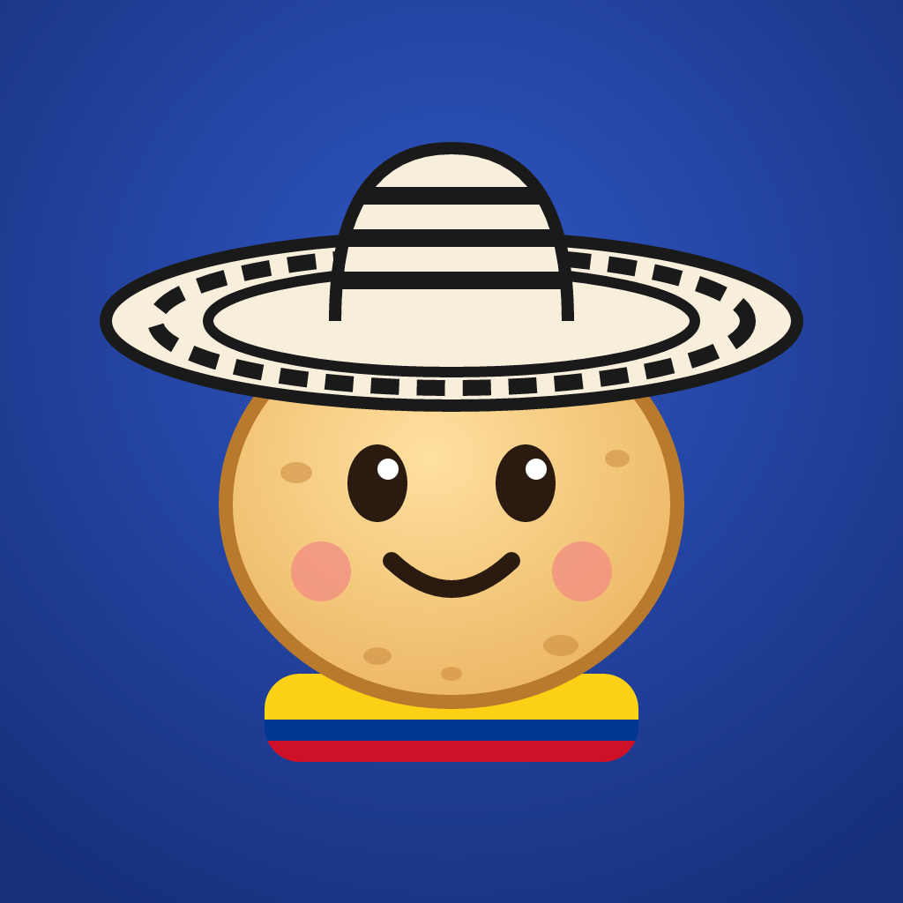

<p align="center">
  
</p>

<h1 align="center">parcerito</h1>

<p align="center">
  Your coding <i>parcero</i> in Slack. <b>Claude</b> plans and reviews, <b>Codex</b> writes the code, you get a PR.
</p>

---

Mention `@parcerito` in Slack with a bug, a Linear ticket, or a Sentry error. It investigates the codebase, writes a plan,
hands the implementation to Codex, reviews the diff, runs the tests, and opens a draft PR, posting progress in the
thread as it goes. For example:

```
you: @parcerito LIN-482 the export button times out for big workspaces, can you fix it?

parcerito: ✅ Done in 6m 12s
  • Checking Linear
  • Searching for `exportWorkspace`
  • Handing the implementation to Codex
  • Codex edited export.ts, export.test.ts
  • Running `npm test -- export`
  The export ran one query per project; I had Codex batch it and stream the CSV instead.
  Tests pass. Draft PR: https://github.com/acme/api/pull/913
```

## Why two models?

Most agents use one model for everything. Parcerito splits the work the way a tech lead and a developer would:

| Role | Model | Does |
| --- | --- | --- |
| 🧠 Brain | Claude Opus 5.5 (Claude subscription) | Reads the ticket, explores the code, plans, reviews the diff, runs the tests, opens the PR |
| 🙌 Hands | GPT-6.1-Sol via Codex (ChatGPT subscription) | Writes the code from Claude's spec, then applies Claude's review feedback |

Writing code is where most of the tokens go, so this spreads the work across two subscriptions: limits last much
longer, and every change gets a second model's review before you see it.

## How it works

```
Slack (Socket Mode, no public URL needed)
  │  @mention / DM, allowlisted users only
  ▼
parcerito (Node + TypeScript, one Docker container)
  ├─ Claude Agent SDK ── the orchestrator
  │    ├─ open_repo          → a git worktree + branch per Slack thread
  │    ├─ delegate_to_codex  → Codex SDK runs GPT-6.1-Sol in that worktree
  │    ├─ Linear MCP, Sentry MCP (optional)
  │    └─ git / gh           → commit, push, `gh pr create --draft`
  └─ /data volume: repo clones, worktrees, Claude & Codex logins, thread sessions
```

- **One thread, one task.** Each Slack thread gets its own worktree and branch (`parcerito/<thread>`), so tasks never
  step on each other. Follow-ups in the thread continue the same Claude session and the same Codex conversation.
- **Thread context.** Mention it inside an existing thread (a Sentry alert, a bug report) and it reads the thread first.
- **Say `stop`** in the thread to cancel the current run.

## Setup

You need a Claude Pro/Max subscription, a ChatGPT plan that includes Codex, a Slack workspace where you can install
apps (or an admin who will approve it), and a [Railway](https://railway.com) account. Any Docker host works too.

### 1. Create the Slack app

1. Go to [api.slack.com/apps](https://api.slack.com/apps) → **Create New App** → **From a manifest**, pick your
   workspace, and paste [`slack-manifest.yml`](slack-manifest.yml). Change the name to yours first.
2. **Basic Information → Display Information**: upload [`assets/parcerito-1024.png`](assets/parcerito-1024.png) as the icon.
3. **Basic Information → App-Level Tokens**: create one with the `connections:write` scope. That's `SLACK_APP_TOKEN` (`xapp-…`).
4. **Install App** to the workspace (or **Request to Install** and ask an admin). Copy the **Bot User OAuth Token**:
   that's `SLACK_BOT_TOKEN` (`xoxb-…`).
5. Get your own member ID (Slack profile → ⋮ → **Copy member ID**) for `ALLOWED_SLACK_USER_IDS`.

### 2. Get the tokens

| Variable | How |
| --- | --- |
| `CLAUDE_CODE_OAUTH_TOKEN` | Run `claude setup-token` on your machine. It's a 1-year token tied to your subscription. |
| `GH_TOKEN` | A [fine-grained token](https://github.com/settings/personal-access-tokens/new) for the repos: Contents and Pull requests read/write. |
| `LINEAR_API_KEY` (optional) | Linear → Settings → Security & access → Personal API keys |
| `SENTRY_ACCESS_TOKEN` (optional) | Sentry → Settings → User Auth Tokens, with the scopes listed in the [Sentry MCP README](https://github.com/getsentry/sentry-mcp) |

### 3. Deploy on Railway

1. **New Project → Deploy from GitHub repo** → pick your fork of this repo. Railway builds the `Dockerfile`.
2. Add a **Volume** to the service mounted at **`/data`**.
3. Add the variables from [`.env.example`](.env.example) under **Variables**.
4. Deploy. The logs should show `⚡ Parcerito is running as @parcerito`.

### 4. Log in to Codex (once)

Codex keeps its login in `/data/codex/auth.json`, so this survives redeploys.

1. In ChatGPT, open **Settings → Security** and enable **device code login for Codex**.
2. Open a shell in the container and log in:
   ```bash
   railway ssh            # from your machine, in the linked project
   codex login --device-auth
   ```
   Open the link it prints, enter the code, then restart the service.

Alternatively, set `CODEX_AUTH_JSON_B64` to `base64 < ~/.codex/auth.json` from a machine where you're logged in. It's
only used on first boot. Use a login dedicated to the bot: sharing one `auth.json` between your laptop and the server
can log one of them out when tokens refresh.

### 5. Try it

In Slack: `@parcerito what does the auth middleware in acme/api do?`, then something real:
`@parcerito fix LIN-123`.

## Local development

```bash
cp .env.example .env   # fill it in; DATA_DIR defaults to ./data
npm install
npm run dev            # uses your local `claude` and `codex` logins if the tokens are unset
npm test
```

## Configuration

See [`.env.example`](.env.example) for every variable. The useful knobs:

| Variable | Default | |
| --- | --- | --- |
| `CLAUDE_MODEL` | `claude-opus-5-5` | The orchestrator |
| `CLAUDE_EFFORT` | `high` | `low` … `max` |
| `CODEX_MODEL` | `gpt-6.1-sol` | The implementer |
| `CODEX_EFFORT` | `medium` | `minimal` … `ultra` |
| `CODEX_SANDBOX` | `danger-full-access` | The container is the sandbox; use `workspace-write` on a host with sandboxing support |
| `BOT_NAME` | `Parcerito` | Name used in its replies |

## Security notes

- **Only allowlisted Slack users can trigger it.** It runs on personal subscriptions; don't share it with the team.
- Both agents run without permission prompts **inside the container**. Give it only the repos it needs, through a
  fine-grained GitHub token, and keep it on its own Railway service.
- It opens **draft PRs** on its own branches and is told never to push to the default branch or force-push. Branch
  protection on your default branch makes that a guarantee rather than a request.

## License

[MIT](LICENSE)
